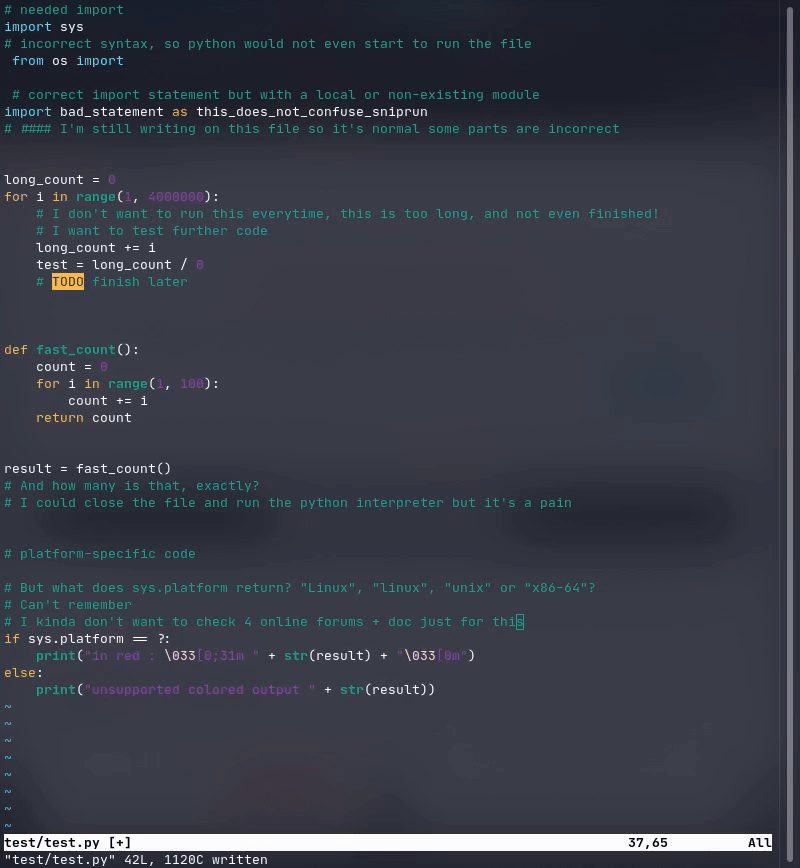
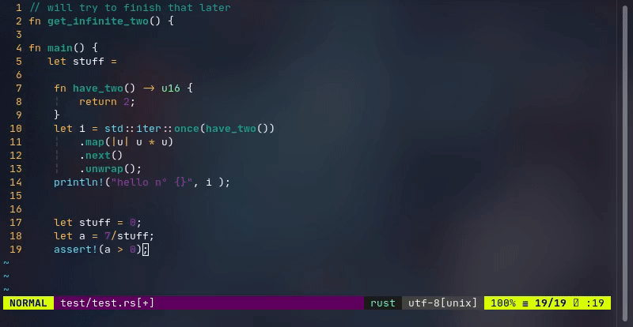

# Sniprun


Sniprun is a code runner plugin. It aims to provide stupidly fast partial code testing for interpreted **and compiled** [languages](#support-levels-and-languages) . Sniprun blurs the line between standart save/run workflow, jupyter-like notebook, unit testing and REPL/interpreters.



(the exact same thing can also be done on **compiled** languages such as Rust, to the relevant support level's extent)



> Note: SnipRun is still under development, so expect new features to be introduced quickly, but also some other things may change and break your workflow.

## What does it do ?

Basically, it allows you to run a part of your code.

Printing the type of that obscure object, or that collection to check if it contains everything you expect mid-editing is not a pipe dream.

Even if as-is your code won't even compile/run because it's unfinished (but to finish it you'd need to assert the first part)

Quickly grab a line or some visual range, `:'<,'>SnipRun` it and... that's it!

(And there's more to come...)

## Installation

### Prerequisites

- Sniprun is Linux-only for now (as of v0.3.0)
- Neovim version >= 0.44 preferably, but should work with older version
- cargo and the rust toolchain version >= 1.43.0 (you can find those [here](https://www.rust-lang.org/tools/install)). Those are needed to build sniprun, for as long as the project is not distributed as binary (see the release section).
- Compiler / interpreter for the languages you work with must be installed & on your \$PATH. In case specific build tools are required, those are documented in the doc folder

### Install Sniprun

(Recommended)

Use your favorite plugin manager.
(Run `install.sh` as a post-installation script, it will download or compile the sniprun binary)

For example, `vim-plug`:

```vim
Plug 'michaelb/sniprun', {'do': 'bash install.sh'}
```

Sniprun is developped and maintained on Linux (-only for now), support for other platforms is not in my goals plans, though simple compatibility patches PR are welcome.

## Usage

Sniprun is and will always (try to) be dead simple. `:SnipRun` a piece of code and the plugin will return its standart output. ( +stderr if supported)

### Running

Line mode: Place your cursor on the line you want to run, and type (in command mode):

```vim
:SnipRun

```

Bloc mode: Select the code you want to execute in visual mode and type in:

```vim
:'<,'>SnipRun
```

(nota bene: the `:'<,'>` is often pre-typed and appears if you type in `:`)

### Stopping

_ARGHHH_ I 'SnipRan' and infinite loop (or anything that takes too long)!
No worries, the second and last command will kill everything Sniprun ran so far (and has not finished yet):

```vim
 :SnipTerminate
```

Under the hood, what it does is just kill Sniprun (and its child processes) and relaunch it, thus a more mnemonic alias for the intention is set `:SnipReset` that does basically the same thing as terminate, but also cleans the cache directory.

Alternatively, exit Neovim.

### Configuration

You can add interpreters you want to always use in case multiples interpreters are available for one file type by adding to your config file / init.vim :

`let g:SnipRun_select_interpreters += ['name_of_the_interpreter']`
For example to always select Lua_original and Rust_original over others,
`let g:SnipRun_select_interpreters +=['Lua_original', 'Rust_original']`

A list of all available interpreters can be displayed by running `:SnipList`

### My usage recommandation & tricks

- Map the line and bloc mode to a simple command such as `ff` (or just `f` in visual mode).

```
nnoremap ff :SnipRun<CR>
vnoremap f :SnipRun<CR>
```

- For interpreted languages with simple output, `:%SnipRun` (or a shortcut) may be a more convenient way to run your entire code.

## Support levels and languages

As of writing, languages can be supported up to different extents:

- **Unsupported** : You should not expect anything to work, except if the generic interpreter works correctly with it \*.
- **Line** : Code contained in a single line works, for example: `print([x**2 for x in range(10)])` . Won't work if you use a variable defined elsewhere.
- **Bloc** : You can select any piece of code that is semantially correct (minus the eventual entry point) on its own (independently of indentation) in visual mode, and run it. A sniprun-able example, in Rust:

```
fn have_two() -> u16 {
  return 2;
}
let i = std::iter::once(have_two() * 3).map(|u| u*u).next().unwrap();
println!("hello n° {}", i+1);
```

- **Import** : Support external imports, so you don't have to select the top-of-file import to test a 'bloc-mode-style' code selection somewhere else.
- **File** : Sniprun will recursively find the missing variable and function definitions to run your line of code(you don't have to select a bloc anymore).
- **Project** : Sniprun will detect the root of your project, and get the necessary code from files in your project.
- **System** : Sniprun will use local (and system) libraries, such as jar files, to run your what you want.

| Language     | Support level |     | Language   | Support level |
| ------------ | ------------- | --- | ---------- | ------------- |
| Assembly     | Unsupported\* |     | JavaScript | Bloc          |
| ats          | Unsupported\* |     | Java       | Bloc          |
| Bash/Shell   | Bloc          |     | Julia      | Unsupported\* |
| C            | Bloc          |     | Lisp       | Unsupported\* |
| COBOL        | Unsupported\* |     | Lua        | Bloc          |
| Coffeescript | Unsupported\* |     | Lua-nvim   | Bloc          |
| C#           | Unsupported\* |     | OCaml      | Unsupported\* |
| C++          | Bloc          |     | Perl6      | Line          |
| D            | Unsupported\* |     | Perl       | Line          |
| Elixir       | Unsupported\* |     | PHP        | Unsupported   |
| Elm          | Unsupported\* |     | Python3    | Import        |
| Erlang       | Unsupported\* |     | Ruby       | Bloc          |
| F#           | Unsupported\* |     | R          | Bloc          |
| Go           | Bloc          |     | Rust       | Bloc          |
| Groovy       | Unsupported\* |     | Scala      | Unsupported\* |
| Haskell      | Bloc          |     | Scilab     | Unsupported\* |
| Idris        | Unsupported\* |     | Swift      | Unsupported\* |

Want support for your language? Submit a feature request, or even better, [contribute](CONTRIBUTING.md), it's easy!

\* SnipRun includes a _'fallback'_ generic interpreter that makes uses of [this](https://github.com/prasmussen/glot-code-runner) project. It allows to (unofficially) have line-level language support for many interpreted languages, though it has many limitations and differences for compiled languages. The reasons interpreted languages are still marked as Unsupported is because of a lack of testing.

## Known limitations

Due to its nature, Sniprun may have trouble with programs that :

- Meddle with standart output / stderr
- Need to read from stdin
- Prints double quotes ("), or incorrect UTF8 characters, or just too many lines
- Purposely fails
- Access files; sniprun does not run in a virtual environment, it accesses files just like your own code do, but since it does not run the whole program, something might go wrong. Relative paths may cause issues, as the current working directory for neovim won't necessarily be the one from where the binary runs, or the good one for relative imports.
- For import support level and higher, Sniprun fetch code from the saved file (and not the neovim buffer). Be sure that the functions / imports your code need have been _saved_.

#### Generic interpreter limitations:

- All interpreted languages get only line level support.
- Compiled languages necessitate to run a a line (!) containing a standart entry point (such as `int main(){....}` for C)
- The detected filetype must match the language name as written on the [project](https://github.com/prasmussen/glot-code-runner) page.
- The project is stale (no active development)

## Mentions & Support

This project is very similar to [this](https://github.com/formulahendry/vscode-code-runner) but is an attempt to make the same kind of plugin for Neovim, preferably simpler, and more complete.

For example, SnipRun Python support is (objectively) sligthly superior, and with some help, can get way, way better. Infrastructure to run code is also more feature-complete, with simple examples to implement basic support for new languages. Compared to the 'one-line-should-run-everything' approach of vs-code-runner, SnipRun can go further.

## Contribute

It's super easy: see [contributing](CONTRIBUTING.md)

## Related projects

All [quickrun](https://github.com/thinca/vim-quickrun/blob/master/autoload/quickrun.vim) derivatives, but they are all different in the way they always all execute your entire file, and cannot make use of your project's Makefile (or compilation config).

Sniprun also add the typical boilerplate so you only need to select the lines that really do the job, rather than those plus everything in the enclosing `int main() {` or equivalent.
