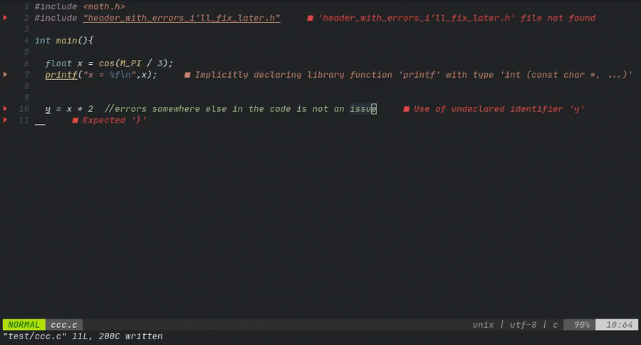
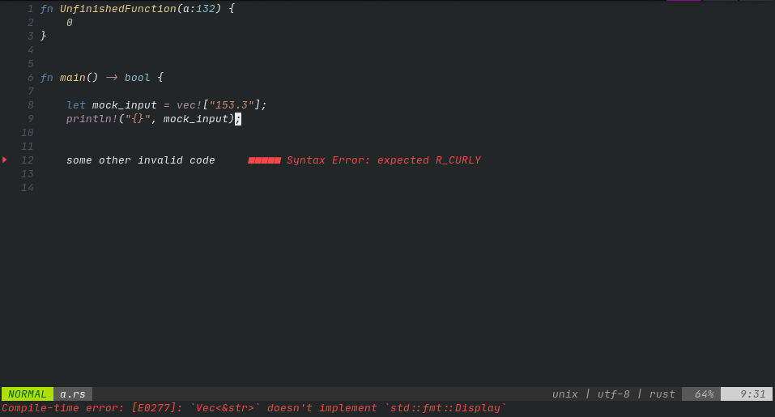

<div style="text-align:center"></div>

<div align="center"><p>
    <a href="https://github.com/michaelb/sniprun/releases/latest">
      
    </a>
     <a href="https://github.com/michaelb/sniprun/actions">
      
    </a>
    <a href="https://github.com/michaelb/sniprun/releases">
      
    </a>
    <a href="https://github.com/michaelb/sniprun/pulse">
      
    </a>
</p>
</div>


# Introduction
Sniprun is a code runner plugin for neovim written in Lua and Rust. It aims to provide stupidly fast partial code testing for interpreted **and compiled [languages](#support-levels-and-languages)** . Sniprun blurs the line between standard save/run workflow, jupyter-like notebook, and REPL/interpreters.


I know that this README is exhaustively long (for the sake of clarity, bear with me), but Sniprun itself is and will remain rather simple: don't be afraid, questions are welcome too.

</br>

###### TLDR: ```Plug 'michaelb/sniprun', {'do': 'bash install.sh'}``` </br> ​ ​ ​   ​  ​  ​  ​  ​  ​  ​ ​ ```:SnipRun```, ```:'<,'>SnipRun```,```:SnipInfo```


​

- [Demos](README.md#demos)
- [What does it do ?](README.md#what-does-it-do-)
- [What it is &amp;&amp; isn't](README.md#what-it-is--isnt)
- [Installation](README.md#installation)
  - [Prerequisites &amp;&amp; dependencies](README.md#prerequisites--dependencies)
  - [Install Sniprun](README.md#install-sniprun)
- [Usage](README.md#usage)
  - [Running](README.md#running)
  - [Stopping](README.md#stopping)
  - [REPL-like behavior](README.md#repl-like-behavior)
  - [Configuration](README.md#configuration)
  - [My usage recommandation &amp; tricks](README.md#my-usage-recommandation--tricks)
- [Supported Languages + levels](README.md#support-levels-and-languages)
- [Known limitations](README.md#known-limitations)
- [Troubleshooting](README.md#troubleshooting)
- [Contribute](README.md#contribute)
- [Related projects](README.md#related-projects)

## Demos

##### Send to Sniprun snippets of any language.
A few lines of code are now within a print statement's reach :-) ([this may be cool](https://github.com/meain/vim-printer))

An example in C, look in the command area:



##### The result can be returned in multiple (even at the same time) ways:

[Classic](ressources/display_classic.md)|  [Virtual Text](ressources/display_virtualtext.md)
:------------------------------------------:|:------------------:
   | 
[**Temporary Floating Window**](ressources/display_floating_window.md)  |  [**Terminal**](ressources/display_terminal.md)
 | 
[**Notification**](ressources/display_notify.md) | [**API**](API.md)
 | 


##### send-to-REPL-like behavior is available for some languages

Python, R, Mathematica, Sage, Julia (all real REPLs) and Bash (simulated), coming soon for many other interpreted and compiled languages. Very versatile, you can even run things like GUI plots on the fly!


##### Does it deal with errors ?

Yes for most interpreters, and many will actually provide additional information (compilation or runtime error etc..), but not all can.



## What does it do ?

Basically, it allows you to run a part of your code.

Do either of:

- Position the cursor on a line and `:SnipRun`
- Select some visual range, then `:'<,'>SnipRun`
- Combine a motion with the operator
- Activate the live mode

  (through a shortcut!)

and ... that's it!

​

Sniprun will then:

- **Get the code** you selected (selections are rounded line-wise)
- Optionally, get additional information if necessary (auto retrieve import when supported for example)
- **Add boilerplate** when it exists. In C, it surrounds your snip with "int main() {", "}". (disclaimer: oversimplifed)
- **Build** (write to a script file, or compile) the code
- **Execute** the code, or send it to an active REPL for evaluation
- Display stdout, or stderr using the chosen method


## What it is && isn't

**It is** a way to quickly run small snippets of code, on the fly, and iterate very quickly and conveniently. To quickly experiment with new features (not yet embedded in classes, a whole project etc...), or to develop simple code pipelines (like a machine learning exercise) that fit in a unique file, sniprun is probably _the_ best plugin out there.

**It isn't** a way to run a whole 50k lines, 3 languages projects. A one-liner `:!make run` is better suited to do this most of the time.

## Installation

### Prerequisites && dependencies

- Sniprun is compatible with **Linux** and **MacOS**. (Mac users _need_ the Rust [toolchain](https://www.rust-lang.org/tools/install)) >= 1.55

- **Neovim** version >= 0.5

- [optional] **cargo and the rust toolchain** version >= 1.43.0 (you can find those [here](https://www.rust-lang.org/tools/install)).

- [optional] the plugin [nvim-notify](https://github.com/rcarriga/nvim-notify) for the notification display style

- **Compiler / interpreter** for the languages you work with must be installed & on your \$PATH. In case specific build tools or softwares are required, those are documented in the [doc](https://github.com/michaelb/sniprun/tree/master/doc) folder, for each interpreter, which I urge you to get a look at before getting started as it also contains the potential limitations of each interpreter; this information can also be accessed through `:SnipInfo <interpreter_name>` (tab autocompletion supported).


### Install Sniprun

Use your favorite plugin manager (recommended) ...

(Run `install.sh` as a post-installation script, it will download or compile the sniprun binary)

<details open><summary>vim-plug</summary>
<p>

```vim
Plug 'michaelb/sniprun', {'do': 'bash install.sh'}
" 'bash install.sh 1' to get the bleeding edge or if you have trouble with the precompiled binary,
"  but you'll compile sniprun at every update & will need the rust toolchain
```

</details>
</p>


<details><summary>packer</summary>
<p>

```
  use { 'michaelb/sniprun', run = 'bash ./install.sh'}
```
</details>
</p>


​

(AUR)


<a href="https://aur.archlinux.org/packages/neovim-sniprun/">
  
</a>

An independently maintained [AUR package](https://aur.archlinux.org/packages/neovim-sniprun/) is available for Arch users.

​

... or install sniprun manually


I trust you know how to add a plugin to the runtimepath, just don't forget to run `./install.sh`, or alternatively, `cargo build --release` to fetch/build the binary.


## Usage

(you can of course see `:help sniprun` once installed for the complete list of commands, and `:SnipInfo` will have a decent share of useful information too)

You can do basically two things: **run** your code selection and **stop** it (in the rare occasions it crashes, it takes too long or sniprun crashes). You'll probably be using only the first one, but the second can come in handy.

​

#### Running

**Line mode:** Place your cursor on the line you want to run, and type (in command mode):

```vim
:SnipRun
"OR
:lua require'sniprun'.run()
"the first command is only a shorthand, you should configure the <Plug>SnipRun mapping
```
(see mapping [example](README.md#my-usage-recommandation--tricks)),

**Running 'live'** (aka running the current line as you're typing is possible, but it's very important to read the warnings about this, so I'm keeping the instructions in [a separate place](ressources/live_mode.md).

**Bloc mode:** Select the code you want to execute in visual mode and type in:

`:'<,'>SnipRun`

(the shorthand for `:lua require'sniprun'.run('v')`)

**Operator mode**:

Configure a mapping to `<Plug>SnipRunOperator` and combine it with movements to sniprun 'text objects'. Every text-object will be rounded line-wise.

​

#### Stopping

_ARGHHH_ I Sniprun'd an infinite loop (or anything that takes too long, or will crash, or anything)!
No worries, the second and last command will kill everything Sniprun ran so far:

```vim
 :SnipReset
```
Alternatively, exit & re-enter Neovim.

​

#### Clearing
You may want to clear virtual text, close a terminal or a floating window created by Sniprun: for this, one command to rule them all:

`:SnipClose`

(plug mapping : `<Plug>SnipClose`)


### REPL-like behavior

Some languages, see support [table](README.md#support-levels-and-languages), also have some kind of REPL behavior: you can expect your successive commands to behave like in a REPL interpreter, and to have 'memory' of lines you have previously sent to sniprun.

This is easier/cleaner to implement on interpreted languages, but **compiled languages can have a REPL-like behavior too** using dirty tricks, or through an intrepreter such as [evcxr](https://github.com/google/evcxr), but no compiled language has REPL behavior for now.

Many interpreted languages will have this behavior enabled or disabled by default, you can change this with the
`repl_enable = { 'Interpreter_name', 'Another_one' }` and `repl_disable = {'Disabled_interpreter'}` keys in the configuration. Relevant info is available in `:SnipInfo` / `:SnipInfo <name> `


Hopefully, if something does not work, or if the 'memory' is corrupted by bad code you can clear the REPL memory with `:SnipReplMemoryClean` that is a faster and less error-prone alternative to `:SnipReset` for this use case.


## Configuration

Sniprun is a Lua plugin, but **you don't need** the usual boilerplate: if you don't need any special configuration, you don't need to do anything *at all*.

However, if you want to change some options, you can add this snippet (the default config) to your configuration file and modify if at will (you can remove keys without issue to shorten your config, as the default values are overwritten on a key-by-key basis):

```bash
lua << EOF
require'sniprun'.setup({
  selected_interpreters = {},     --# use those instead of the default for the current filetype
  repl_enable = {},               --# enable REPL-like behavior for the given interpreters
  repl_disable = {},              --# disable REPL-like behavior for the given interpreters

  interpreter_options = {         --# interpreter-specific options, see docs / :SnipInfo <name>

    --# use the interpreter name as key
    GFM_original = {
      use_on_filetypes = {"markdown.pandoc"}    --# the 'use_on_filetypes' configuration key is
                                                --# available for every interpreter
    },
    Python3_original = {
        error_truncate = "auto"         --# Truncate runtime errors 'long', 'short' or 'auto'
                                        --# the hint is available for every interpreter
                                        --# but may not be always respected
    }
  },      

  --# you can combo different display modes as desired
  display = {
    "Classic",                    --# display results in the command-line  area
    "VirtualTextOk",              --# display ok results as virtual text (multiline is shortened)

    -- "VirtualTextErr",          --# display error results as virtual text
    -- "TempFloatingWindow",      --# display results in a floating window
    -- "LongTempFloatingWindow",  --# same as above, but only long results. To use with VirtualText__
    -- "Terminal",                --# display results in a vertical split
    -- "TerminalWithCode",        --# display results and code history in a vertical split
    -- "NvimNotify",              --# display with the nvim-notify plugin
    -- "Api"                      --# return output to a programming interface
  },

  display_options = {
    terminal_width = 45,       --# change the terminal display option width
    notification_timeout = 5   --# timeout for nvim_notify output
  },

  --# You can use the same keys to customize whether a sniprun producing
  --# no output should display nothing or '(no output)'
  show_no_output = {
    "Classic",
    "TempFloatingWindow",      --# implies LongTempFloatingWindow, which has no effect on its own
  },

  --# customize highlight groups (setting this overrides colorscheme)
  snipruncolors = {
    SniprunVirtualTextOk   =  {bg="#66eeff",fg="#000000",ctermbg="Cyan",cterfg="Black"},
    SniprunFloatingWinOk   =  {fg="#66eeff",ctermfg="Cyan"},
    SniprunVirtualTextErr  =  {bg="#881515",fg="#000000",ctermbg="DarkRed",cterfg="Black"},
    SniprunFloatingWinErr  =  {fg="#881515",ctermfg="DarkRed"},
  },

  --# miscellaneous compatibility/adjustement settings
  inline_messages = 0,             --# inline_message (0/1) is a one-line way to display messages
				   --# to workaround sniprun not being able to display anything

  borders = 'single',              --# display borders around floating windows
                                   --# possible values are 'none', 'single', 'double', or 'shadow'
  live_mode_toggle='off'       --# live mode toggle, see Usage - Running for more info   
})
EOF
```

Example, to use the interpreter 'Python3\_jupyter' whenever possible [instead of the 'Python3\_original' default],
`lua require'sniprun'.setup({selected_interpreters = {'Python3_jupyter'}})`

**NOTE**: Some interpreters have specific options and dependencies, such as what version / compiler to use: you cand find more about that with `:SnipInfo <interpreter_name>`. The `use_on_filetypes` key is available for every interpreter (as an `interpreter_option`) and allow sniprun to understand that your particular/custom filetypes are compatible with an interpreter.


​

All of sniprun functionalities:

| Shorthand                     | Lua backend                               | \<Plug> mapping             |
|-------------------------------|-------------------------------------------|-----------------------------|
| :SnipRun                      | lua require'sniprun'.run()                | \<Plug\>SnipRun             |
| (normal node)                 | lua require'sniprun'.run('n')             | \<Plug\>SnipRunOperator     |
| :'\<,'\>SnipRun (visual mode) | lua require'sniprun'.run('v')             | \<Plug\>SnipRun             |
| :SnipInfo                     | lua require'sniprun'.info()               | \<Plug\>SnipInfo            |
| :SnipReset                    | lua require'sniprun'.reset()              | \<Plug\>SnipReset           |
| :SnipReplMemoryClean          | lua require'sniprun'.clear\_repl()        | \<Plug\>SnipReplMemoryClean |
| :SnipClose                    | lua require'sniprun.display'.close\_all() | \<Plug\>SnipClose           |
| :SnipLive                     | lua require'sniprun.live\_mode'.toggle()  | \<Plug\>SnipLive            |
| ✖                             | lua require'sniprun.api'.run\_range(..)   | ✖                           |
| ✖                             | lua require'sniprun.api'.run\_string(..)  | ✖                           |


### Mappings & recommandations

- Map the run command to a simple command such as `<leader>ff` (or just `f` in visual mode)
- Check `SnipInfo` & `:SnipInfo <interpreter_name>` to learn any quirk or tips about the language you're interested in
- The operator mapping allows you to combine movements with sniprun: with the suggested mapping, "\<leader\>f + j" will run sniprun on the current line + the line below.

  (if you don't know what is the leader key you can find a short explanation [here](https://vim.works/2019/03/03/vims-leader-key-wtf-is-it/)).

<details><summary> recommended mappings in lua</summary>
<p>

```
vim.api.nvim\_set\_keymap('v', 'f', '<Plug>SnipRun', {silent = true})
vim.api.nvim\_set\_keymap('n', '<leader>f', '<Plug>SnipRunOperator', {silent = true})
vim.api.nvim\_set\_keymap('n', '<leader>ff', '<Plug>SnipRun', {silent = true})
```
</details>
</p>

<details open><summary> recommended mappings in vimscript</summary>
<p>

```
nmap <leader>ff <Plug>SnipRun
nmap <leader>f <Plug>SnipRunOperator
vmap f <Plug>SnipRun
```
</details>
</p>

- For interpreted languages with simple output, `:%SnipRun` (or a shortcut, wrapping it with `let b:caret=winsaveview()` and `call winrestview(b:caret)` in order to keep the cursor at the current position) may be a more convenient way to run your entire file. When running the whole file, SnipRun supports taking arguments on the command line: `:%SnipRun 5 "yay"` frictionlessly for interpreted languages, and compiled languages with entry point detection implemented (most of them).


While both shorthands and \<Plug> are here to stay, **please use the `<Plug>` style ones in your mappings** or if using from another plugin.


Sniprun synergises exceptionnally well with plugins that help you creating print/debug statements, such as [vim-printer](https://github.com/meain/vim-printer).


## Support levels and languages

As of writing, languages can be supported up to different extents:

- **Unsupported**/**Untested** : You should not expect anything to work, except if the generic interpreter works correctly with it (at most Line level support).
- **Line** : Code contained in a single line works, for example: `print([x**2 for x in range(10)])` . Won't work if you use a variable defined elsewhere.
- **Bloc** : You can select any piece of code that is semantically correct (minus the eventual entry point) on its own (independently of indentation) in visual mode, and run it. A sniprun-able example, in Rust:

```
let alphabet = String::from\_utf8(
    (b'a'..=b'z').chain(b'A'..=b'Z').collect()).unwrap();

println!("-> {}", alphabet);
```

- **Import** : Support external imports, so you can test blocs of code that also depends on that external library import.
>
<ul>
<li><span style="color:grey"><b>File</b> : Sniprun will recursively find the missing variable and function definitions to run your line of code(you don't have to select a bloc anymore).</span>
<li> <span style="color:grey"><b>Project</b> : Sniprun will detect the root of your project, and get the necessary code from files in your project, including relative imports. Basically everything you sniprun will 'work'.
</ul>
</span>

​

| Language     | Support level | REPL Capabilities|    
| ------------ | ------------- | ---------------- |
| Ada          | Line          | No               |
| Bash/Shell   | Bloc          | Yes\*            |
| C            | Import        | No               |
| C++          | Import        | No               | 
| Clojure      | Bloc          | Yes \*\*         | 
| Coffeescript | Bloc          | No               |   
| D            | Bloc          | No               | 
| F#           | Bloc          | No, but _could_ \*\* |
| Go           | Import        | No               | 
| Haskell      | Line          | No               | 
| Java         | Bloc          | No               | 
| JavaScript   | Bloc          | Yes\*\*   (Deno) | 
| Julia        | Bloc          | Yes\*\*          | 
| Lua          | Bloc          | No               | 
| Lua-nvim     | Bloc          | Yes\*\*          |
| Markdown     | Bloc          | Yes\*\*\*        |
| Mathematica  | Bloc          | Yes\*\*          |
| OrgMode      | Bloc          | Yes\*\*\*        |
| Perl/Perl6   | Line          | No               | 
| Python3      | Import        | Yes\*\*          |
| R            | Bloc          | Yes\*\*          |
| Ruby         | Bloc          | No               | 
| Rust         | Bloc          | No               | 
| SageMath     | Import        | Yes\*\*          |
| Scala        | Bloc          | No               | 
| TypeScript   | Bloc          | Yes\*\*   (Deno) |  

Want support for your language? Submit an [issue](https://github.com/michaelb/sniprun/issues/new?assignees=&labels=new-langage-support&template=support-for--language-.md&title=), or even better, [contribute](CONTRIBUTING.md), it's easy!

\* (fake) REPL-like functionnality, with potential unwanted side-effects

\*\* True REPL under the hood

\*\*\* if underlying language supports it


## Known limitations

Due to its nature, Sniprun may have trouble with programs that :

- Mess with standart output / stderr
- Need to read from stdin
- Print incorrect UTF8 characters, or just too many lines
- Access files; sniprun does not run in a virtual environment, it accesses files just like your own code do, but since it does not run the whole program, something might go wrong. **Relative paths may cause issues**, as the current working directory for sniprun will be somewhere in ~/.cache/sniprun, and relative imports may miss.

## Troubleshooting

Begin by updating the plugin and running `:SnipReset` and then `:checkhealth sniprun`

- **Silent fail**: the sniprun binary may be incompatible with your distro/OS/arch. Use `bash ./install.sh 1` as post-install to compile locally.

## Changelog && Roadmap

v1, the first stable version, is out!

It's been quite a journey already. For history fans:
[Changelog](CHANGELOG.md)

Writing down some ideas here for future features:
- LSP support (for File and Project support levels)
- auto-print if only an expression is sniprun'd
- allow running directly functions with arguments provided on the command line

I'm currently taking a break from the sniprun project, especially developping complex features, but I will maintain this project and review PRs happily!

## Contribute

It's super easy: see the exhaustive (but simple I hope) [CONTRIBUTING.md](CONTRIBUTING.md).
I actually thought out the project structure so you only have to worry about one file (yours), when creating an interpreter. All you have to do is copy the example.rs interpreter and modify some parts to suit the language you wish to support.


​

## Related projects

This: [vscode-code-runner](https://github.com/formulahendry/vscode-code-runner) but sniprun is an attempt to make the same kind of plugin for Neovim, and more feature-complete. Actually, it already is (more complete, more extendable).

- [quickrun](https://github.com/thinca/vim-quickrun) derivatives, but they are all different in the way they always all execute your entire file. The limitation to a single bash/vimscript command to compile and execute looks suboptimal to me.

- [replvim](https://gitlab.com/HiPhish/repl.nvim) project, [vim-ipython-cell](https://github.com/hanschen/vim-ipython-cell) [codi](https://github.com/metakirby5/codi.vim) as well as [neoterm](https://github.com/kassio/neoterm) and [vim-slime](https://github.com/jpalardy/vim-slime) can also be used in such a way, though they are only working with languages that have a REPL.
- [vimcmdline](https://github.com/jalvesaq/vimcmdline) is a close contender and so is / will be [conjure](https://github.com/Olical/conjure), and more recently [dash](https://github.com/jbyuki/dash.nvim) but they do things differently enough I made sniprun instead.

And many more projects, somewhat similar, but never quite, that I didn't like, notice, and I'm apologizing for not including yours if you want so but it's very long already.


​

####  **Why should you use sniprun instead of these alternatives?**

- **All-language support**. Sniprun can work with virtually any language, including compiled ones. If the language is not supported yet, anyone can create a sniprun interpreter for it!
- **Better output/display**. Sniprun doesn't use precious screen space (like [codi](https://github.com/metakirby5/codi.vim) or [vim-slime](https://github.com/jpalardy/vim-slime)) by default (but it can).
- **Fast, extendable and maintainable**: this is not a 2k-lines vim script, nor an inherently limited one-liner. It's a Rust project designed to be as clear and "contribuable" as possible.

