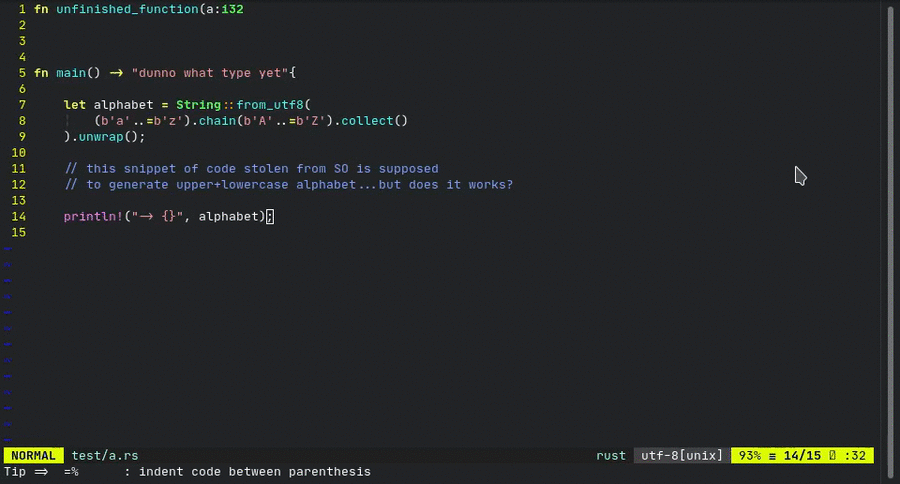
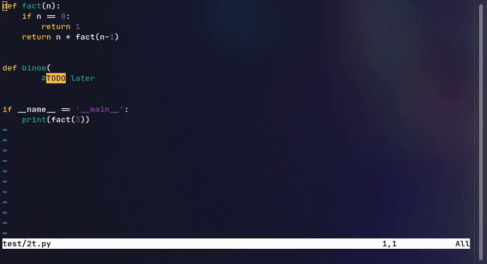

<div style="text-align:center"></div>

<div align="center"><p>
    <a href="">
      
    </a>
     <a href="">
      
    </a>
    <a href="">
      
    </a>
     <a href="">
      
    </a>
    <a href="">
      
    </a>


</p>
</div>


# Introduction
Sniprun is a code runner plugin for neovim written in Lua and Rust. It aims to provide stupidly fast partial code testing for interpreted **and compiled [languages](#support-levels-and-languages)** . Sniprun blurs the line between standard save/run workflow, jupyter-like notebook, unit testing and REPL/interpreters.


I know that this README is exhaustively long (for the sake of clarity, bear with me), but Sniprun itself is and will remain rather simple: don't be afraid, questions are welcome too.

###### TLDR: ```Plug 'michaelb/sniprun', {'do': 'bash install.sh'} ```, ```:SnipRun```, ```:'<,'>SnipRun```,
###### (but please configure the \<Plug> mappings)


- [Demos](README.md#demos)
- [What does it do ?](README.md#what-does-it-do-)
- [Installation](README.md#installation)
  - [Prerequisites &amp;&amp; dependencies](README.md#prerequisites--dependencies)
  - [Install Sniprun](README.md#install-sniprun)
- [Usage](README.md#usage)
  - [Running](README.md#running)
  - [Stopping](README.md#stopping)
  - [REPL-like behavior](README.md#repl-like-behavior)
  - [Configuration](README.md#configuration)
  - [My usage recommandation &amp; tricks](README.md#my-usage-recommandation--tricks)
- [Supported Languages + levels](README.md#support-levels-and-languages)
- [Known limitations](README.md#known-limitations)
- [Contribute](README.md#contribute)
- [Related projects](README.md#related-projects)

## Demos

Send to Sniprun snippets of **compiled** languages such as Rust. A few lines of code are now within a print statement's reach.



send-to-REPL-like behavior is available for Python, R (both real REPLs) and Bash (simulated), coming soon for many other interpreted and compiled languages. Very versatile, you can even run things like GUI plots on the fly!



Does it deals with errors ? Yes,...somehow. In practice, very well; but consistency among all languages and usages is not garanteed, each interpreter can and will display those more or less nicely. Though, Sniprun will often provide information such as where the error occurred (compilation, runtime...).


> Note: SnipRun is still under development, so expect new features to be introduced quickly, but also some other things may change and break your workflow.


## What does it do ?

Basically, it allows you to run a part of your code, even if as-is your code won't even compile/run because it's unfinished (but to finish it you'd need to assert the first part)

Quickly grab a line or some visual range, `:'<,'>SnipRun` it and... that's it!

By selecting a visual range (always rounded line-wise) or positioning yourself on a particular line of code, and running the `SnipRun` command on it (I advise to map it), you can send the line(s) to Sniprun. Sniprun will then:

- Optionnaly, get additional information if necessary (auto retrieve import when supported for example)
- Add the boilerplate when it exists. In C, it surrounds your snip with "int main() {", "}".
- Build (write to a script file, or compile) the code
- Execute the code
- Return stdout, or stderr


## Installation

### Prerequisites && dependencies

- Sniprun is Linux-only for now (as of v0.4.7), so you need Linux.
- Neovim version (>= 0.43 preferably), but should work with older versions
- [recommended, but optionnal] cargo and the rust toolchain version >= 1.43.0 (you can find those [here](https://www.rust-lang.org/tools/install)).
- Compiler / interpreter for the languages you work with must be installed & on your \$PATH. In case specific build tools or softwares are required, those are documented in the **[doc](https://github.com/michaelb/sniprun/tree/master/doc) folder, for each interpreter, which I urge you to get a look at** before getting started as it also contains the potential limitations of each interpreter.


### Install Sniprun

(Recommended)

Use your favorite plugin manager.
(Run `install.sh` as a post-installation script, it will download or compile the sniprun binary)

For example, `vim-plug`:

```vim
Plug 'michaelb/sniprun', {'do': 'bash install.sh'}
" 'bash install.sh 1' to get the bleeding edge or if you have trouble with the precompiled binary,
"  but you'll compile sniprun at every update & will need the rust toolchain
```


(Manual)

I trust you know what you're doing, just don't forget to run `./install.sh`, or alternatively, `cargo build --release`.


## Usage

(you can of course see `:help sniprun` once installed for the complete list of commands)

You can do basically two things: **run** your code selection and **stop** it (in the rare occasions it crashes, it takes too long or sniprun crashes). You'll probably be using only the first one, but the second can come in handy.

#### Running

**Line mode: Place your cursor on the line you want to run, and type (in command mode):**

```vim
:SnipRun
```

**Bloc mode: Select the code you want to execute in visual mode and type in:**

```
:'<,'>SnipRun
```

(nota bene: the `:'<,'>` is often pre-typed and appears if you type in `:` while in visual mode)

#### Stopping

_ARGHHH_ I Sniprun'd an infinite loop (or anything that takes too long, or will crash, or anything)!
No worries, the second and last command will kill everything Sniprun ran so far:

```vim
 :SnipReset
```

Alternatively, exit & re-enter Neovim.


### REPL-like behavior

Some languages, see support [table](README.md#support-levels-and-languages), also have some kind of (real, or 'simulated') REPL behavior: you can expect your successive commands to behave like in a REPL interpreter, and to have 'memory' of lines you have previously sniprun'd.


Interpreted languages may use a simulated or real REPL, depending on the implementation.
For many languages that have an interpreter already available, a real one can be used.

Compiled languages can have this simulated REPL behavior too, though there might be unavoidable side effects.

Many interpreted languages will have this behavior enabled by default, but you can always disable those (or enable them) with the `g:SnipRun_repl_behavior_disable` and `g:SnipRun_repl_behavior_enable` blocklist / allowlist:

```vimrc
let g:SnipRun_repl_behavior_disable = ["Bash_original"]
let g:SnipRun_repl_behavior_enable = ["Rust_original", "Lua_original"]
```

REPL-like behavior is experimental and will work better with interpreted languages and with side-effect-free code (including prints in functions).

Hopefully, if it does not work, or if the 'memory' is corrupted by bad code (for example, in C you can't define the same function twice), you can clear the REPL memory with `:SnipReplMemoryClean` that is a faster and less error-prone alternative to `:SnipReset` for this use case.


## Configuration

You can add interpreters you want to always use in case multiples interpreters are available for one file type by adding to your config file / init.vim :

`let g:SnipRun_select_interpreters = ["name_of_the_interpreter"]`

For example to always select Lua_original and Rust_original over others,

`let g:SnipRun_select_interpreters =["Lua_original", "Rust_original"]`

A list of all available interpreters can be displayed by running `:SnipInfo`

The variable `g:SnipRun_inline_messages` (0 or 1) determine whether the messages should be inlined (better compatibility with some configs, and based on echomsg) or be displayed as multiline (default, 0).

### My usage recommandation & tricks

- Map the run command to a simple command such as `<leader>f` (or just `f` in visual mode).
  (if you don't know what is the leader key you can find a short explanation [here](https://vim.works/2019/03/03/vims-leader-key-wtf-is-it/)).

```
nmap <leader>f <Plug>SnipRun
vmap f <Plug>SnipRun
```

- For interpreted languages with simple output, `:%SnipRun` (or a shortcut) may be a more convenient way to run your entire code.
- If you use the REPL-like behavior for some languages, mapping the repl reset to a short command is advised.

```
nmap <leader>c :SnipReplMemoryClean<CR>
```

SnipRun has both `<Plug>`-style commands and old-style plugin-defined commands (`:SnipRun`).
Each `:` command matches exactly a `<Plug>` one.

While both are here to stay, **please use the `<Plug>` style ones in yours mappings** or if using from another plugin. Bonus; with Plug mappings, if you also have Tim Pope's [vim-repeat](https://github.com/tpope/vim-repeat), you can repeat a SnipRun with "`.`"  .


SnipRun synergises exceptionnally well with plugins that help you creating print/debug statements, such as [vim-printer](https://github.com/meain/vim-printer).


## Support levels and languages

As of writing, languages can be supported up to different extents:

- **Unsupported**/**Untested** : You should not expect anything to work, except if the generic interpreter works correctly with it (at most Line level support).
- **Line** : Code contained in a single line works, for example: `print([x**2 for x in range(10)])` . Won't work if you use a variable defined elsewhere.
- **Bloc** : You can select any piece of code that is semantically correct (minus the eventual entry point) on its own (independently of indentation) in visual mode, and run it. A sniprun-able example, in Rust:

```
let alphabet = String::from_utf8(
    (b'a'..=b'z').chain(b'A'..=b'Z').collect()
).unwrap();

println!("-> {}", alphabet);
```

- **Import** : Support external imports, so you don't have to select the top-of-file import to test a 'bloc-mode-style' code selection somewhere else.
- **File** : Sniprun will recursively find the missing variable and function definitions to run your line of code(you don't have to select a bloc anymore).
- **Project** : Sniprun will detect the root of your project, and get the necessary code from files in your project.
- **System** : Sniprun will use local (and system) libraries, such as jar files, to run your what you want.

| Language     | Support level |     | Language   | Support level    |
| ------------ | ------------- | --- | ---------- | ---------------- |
| Ada          | Untested      |     | Java       | Bloc             |
| Bash/Shell   | Bloc + REPL\* |     | JavaScript | Bloc             |
| C            | Import        |     | Julia      | Bloc             |
| C++          | Import        |     | Lisp       | Untested         |
| Clojure      | Untested      |     | Lua        | Bloc             |
| COBOL        | Untested      |     | Lua-nvim   | Bloc             |
| Coffeescript | Bloc          |     | OCaml      | Untested         |
| C#           | Untested      |     | Perl6      | Line             |
| D            | Bloc          |     | Perl       | Line             |
| Elixir       | Untested      |     | PHP        | Untested         |
| Elm          | Untested      |     | Python3    | Import +REPL\*\* |
| Erlang       | Untested      |     | R          | Bloc + REPL \*\* |
| F#           | Untested      |     | Ruby       | Bloc             |
| Go           | Bloc          |     | Rust       | Bloc             |
| Groovy       | Untested      |     | Scala      | Untested         |
| Haskell      | Line          |     | Scilab     | Untested         |
| Idris        | Untested      |     | Swift      | Untested         |

Want support for your language? Submit a feature request, or even better, [contribute](CONTRIBUTING.md), it's easy!

\* (fake) REPL-like functionnality, with potential unwanted side-effects

\*\* True REPL under the hood


## Known limitations

Due to its nature, Sniprun may have trouble with programs that :

- Meddle with standart output / stderr
- Need to read from stdin
- Prints incorrect UTF8 characters, or just too many lines
- Access files; sniprun does not run in a virtual environment, it accesses files just like your own code do, but since it does not run the whole program, something might go wrong. **Relative paths may cause issues**, as the current working directory for neovim won't necessarily be the one from where the binary runs, or the good one for relative imports.
- For import support level and higher, Sniprun fetch code from the saved file (and not the neovim buffer). Be sure that the functions / imports your code need have been _saved_.

## Changelog
[changelog](CHANGELOG.md)

## Contribute

It's super easy: see [contributing](CONTRIBUTING.md).
I actually thought out the project structure so you only have to worry about one file (yours), when creating an interpreter. All you have to do is copy the example.rs interpreter and modify some parts to suit the language you wish to support.


## Related projects

This project: [vscode-code-runner](https://github.com/formulahendry/vscode-code-runner) but sniprun is an attempt to make the same kind of plugin for Neovim, and more feature-complete. Actually, it already is (more complete, more extendable).

All [quickrun](https://github.com/thinca/vim-quickrun/blob/master/autoload/quickrun.vim) derivatives, but they are all different in the way they always all execute your entire file.

The [replvim](https://gitlab.com/HiPhish/repl.nvim) project, [vim-ipython-cell](https://github.com/hanschen/vim-ipython-cell) [codi](https://github.com/metakirby5/codi.vim) as well as [neoterm](https://github.com/kassio/neoterm) and [vim-slime](https://github.com/jpalardy/vim-slime) can also be used in such a way, though they are only working with languages that have a REPL.

[vimcmdline](https://github.com/jalvesaq/vimcmdline) is a close contender and so is / will be [conjure](https://gtihub.com/Olical/conjure), but they do things differently enough I made sniprun instead.


**Why should you use sniprun instead of these alternatives?**

- All-language support. Sniprun can work with virtually any language, including compiled ones. If the language is not supported yet, anyone can create a sniprun interpreter for it!
- Simpler user input & output. Sniprun doesn't use precious screen space (like [codi](https://github.com/metakirby5/codi.vim) or [vim-slime](https://github.com/jpalardy/vim-slime)).
- Promising evolution of the project: treesitter usage is in the goals plan, to make testing/ running even better (with things like auto-fecthing variables & functions definitions). Those will comply at least with the File support level for a truly amazing experience. (I'll need some help with that though).
- Fast, extendable and maintainable: this is not a 2k-lines vim script, nor an inherently limited one-liner. It's a Rust project designed to be as clear and "contribuable" as possible.
